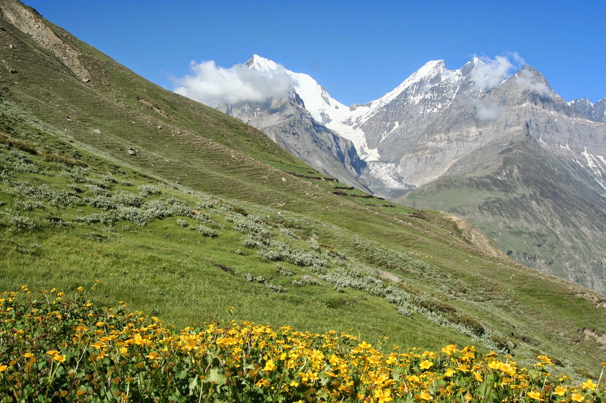

We live in a time when we’ve gone beyond ‘pollution’ and ‘global warming’. Through repetitive and unfruitful use, we’re truly and surely bored of our ‘diplomatic’ effort of saving the earth. We’ve thought about reducing carbon footprints, we’ve Googled about renewable energy sources, some of us even pondered at the thought of replacing his Motorcycle with an e-bike!

We all wait for a better tomorrow. But there will be no better tomorrow if there is no better ‘us’. Can we change the world? No chance. But we can save the surrounding we’re in. We can easily keep it clean. We can easily switch our 4 wheeler for a bicycle, for the ride to work, everyday. We can easily save our mountains, rivers, countrysides from having the same fate of our cities.

We leave the ‘big’ job of tackling issues such as Global Warming to the white collared men, whereas we, take up the ‘small’ motto of keep our mountains clean. No, we don’t have t-shirts with slogans like ‘leaving only footprints behind’, and trudging the mountain slopes with a 30-40 men and women having a party in the Himalayas. We operate strictly in small groups, which also enables us for better personalized attention, and finds us in a much better situation to tackle ‘Littering’.
As a really ‘small’ entity, we really can’t help the cause any more than doing our part thoroughly. But we hope that helps, somewhere. Cause we really love our mountains, and we always ensure we go that extra mile, or two, to keep it pristine.
