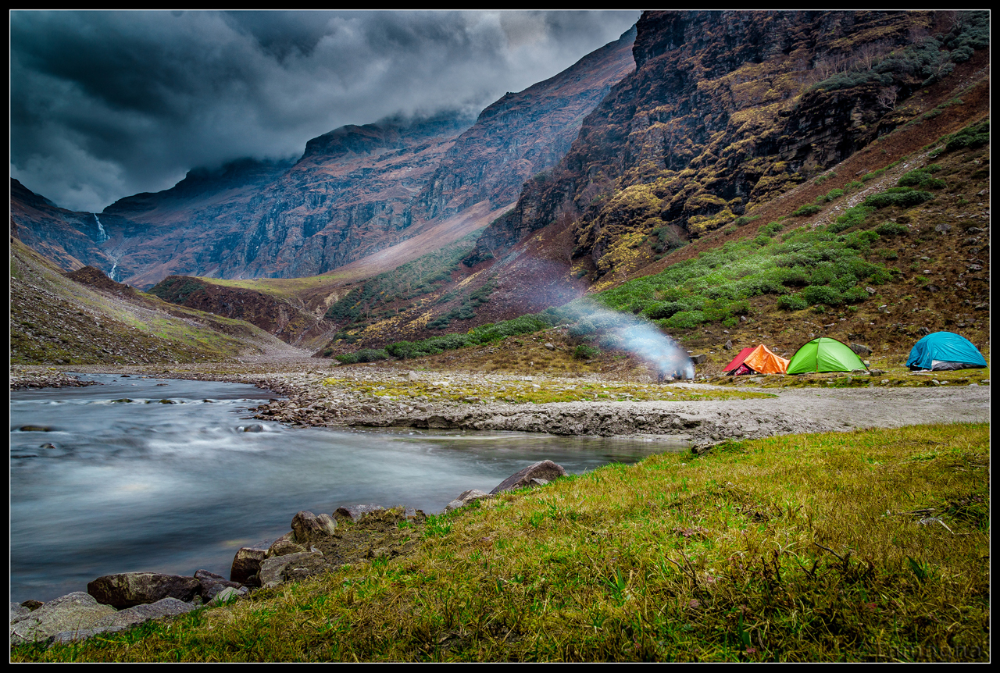

A superb trail for all kinds of adventurers, this classic trail connects Garhwal with Kinnaur district of Himachal. Cascading waterfalls, Ice Bridges, vast, undulating meadows, flocks of sheep, blue skies and sleepy hamlets…Rupin Pass trail has it all!

Rather than the conventional starting point of Dhaula, we start from Kwar, in the Dodra-Kwar tehsil of Shimla district. This way we actually shorten the trek by a day and avoid the rather uneventful trail between Dhaula and Sewa. The trail follows the Rupin Gad all the way to the 3 connecting waterfalls above Dhanderas Thatch. You’ll be crossing over to Himachal just before Sewa village.

The trail is full of Apple and Apricot trees. Also notice the typical Himachali architectures in the village of Jhaka. The Jhaka village is situated delicately in a small flat stretch of land in an otherwise steep slope. Making it look like a hanging village.

Their should be some snow near the pass, especially in the Kinnur side. The final push to the pass is very steep, but that’s a very short section anyway. Climbing through the 3 waterfalls can be a bit risky, make sure you follow the guide’s prescribed path, won’t be wise to make your own path through the slippery rocks! Other than that, this trek is a fairly easy walk, but full of Breathtaking scenaries. And the best thing about the trek? Can be completed in a week’s Holiday from Delhi!

## Itinerary

### 28th May: Shimla-Kwar
This is a unique journey through a seldom visited part of Himachal, the Pabbar valley. Though the distance is almost 200km, the roads are in good condition upto Rohru. After that we’ll cross Chansal Ghati and reach Kwar before evening. Kwar is a large village with its own helipad and SDM. The temples at Dodra and Kwar are worth seeing: their exteriors are covered with the mounted heads of various wild animals, most of them a rarity nowadays. Overnight at Rest House.

### 29th May: Kwar-Jhaka
Continue up the Rupin on the next day, cross it at Jiskoon, and climb steadily to Jhaka, the hanging village. This is also the last village on the trail. Overnight at Trekker’s Hut.

### 30th May: Jhakha-Dhanderas Thatch
Today’s trek starts through the beautiful pine forests just after Jhaka, which eventually becomes more devoid of trees after Buras Kandi, a nice little campsite on the way. A short descent through a not so dense forest will take us to a large valley overlooking the waterfalls on the left of your trail. Just before Saruwas Thatch the trees gives way to meadows and it becomes a heavenly walk. Overnight at Tents, near the cascading waterfalls.

### 31st May: Dhanderas Thatch-Upper Waterfall Camp
It’ll be a mystery as to think how does one really goes through the waterfall, as you can’t really see any trail from a distance. Well, the trail actually goes right beside the waterfalls with some very steep sections. But you’ll be on top of the topmost waterfall in no time, and after another gradual 2 hours ascent, camp at Rato Pheri. Overnight at Tents.

#### 1st June: Waterfall Camp-Rupin Pass-Ronti Gad
This is the day we were waiting for! Because we camp so near to the pass, we’ll be below the gully which leads to the pass within an hour of starting. Still fresh and early in the day, it shouldn’t take more than a hour to complete the final climb. The views toward Kinnaur is mind blowing. After a long but not so steep descent, we camp at Ronti Gad. Overnight at Tents.

### 2nd June: Ronti Gad-Sangla
Today is another long day. But amidst beautiful open landscapes. The trail becomes wider as you come close to Sangla Kanda. Snagla will be another couple of hours of steep descent through the Rukti Gad valley. Overnight at a Hotel.

## What's included

- All meals from 28th May Dinner to 2nd June Breakfast. Meals will be veg and non-veg.
- Transfer to Kwar from Sangla.
- Deluxe Tourist Hotel in Sangla.
- Expert bilingual guide.
- Services of Porters/Mules to carry all group and personal gear.
- Services of Cooking Staff.
- Group medical kit.
- Good quality accommodation at Trekker’s Huts/Tents during trek.
- Private transportation.
- All park entrance fees and trekking permits.
